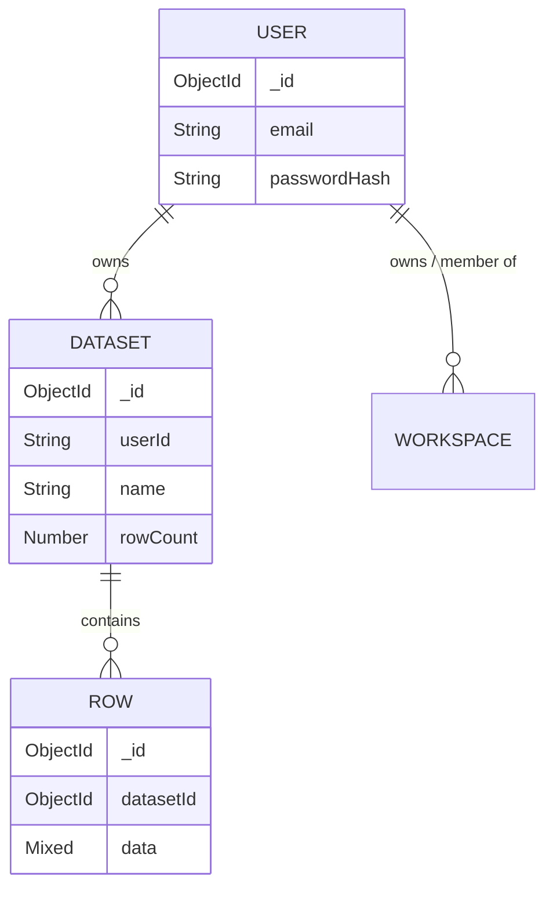

# DataPulse Architecture Report & System Blueprint

## 1. Executive Summary
- **Application Purpose**: A SaaS Analytics Dashboard designed to ingest, process, and analyze tabular datasets, offering both traditional charting and AI-driven insights.
- **Main Business Functions**: Dataset ingestion (CSV/Excel), interactive data visualization (Recharts), AI-powered automated insights generation, secure user authentication, workspace management.
- **User Types**: 
  - Admin/Owner (Default for Google Auth)
  - Viewer/Analyst (Workspace roles)
- **High-level Architecture**: Monolithic serverless Next.js application utilizing the App Router. The frontend leverages React 18, Tailwind CSS, Framer Motion, and Zustand for state. The backend uses Next.js Route Handlers connecting directly to MongoDB Atlas via Mongoose.
- **Technology Stack**: Next.js 14, React 18, TypeScript, Tailwind CSS, MongoDB, Mongoose, NextAuth.js, Zustand, SWR, Recharts, Framer Motion, Papaparse (CSV parsing), XLSX (Excel parsing), Groq API (LLM).

---

## 2. Project Structure Analysis

```text
app/
├── (auth)/              # Authentication pages (Login, Register)
├── (dashboard)/         # Main authenticated application shell & routes
│   ├── charts/          # Interactive visualization builder
│   ├── compare/         # Dataset comparison tools
│   ├── dashboard/       # Main dashboard summary
│   ├── datasets/        # Dataset management
│   ├── explore/         # Tabular data exploration
│   ├── import/          # CSV/Excel ingestion pipeline
│   ├── insights/        # AI-driven insights
│   ├── report/          # Executive report generation
│   ├── smart-insights/  # Interactive AI Q&A
│   └── workspace/       # Workspace & team management
├── api/                 # Next.js Serverless API Route Handlers
│   ├── ai-insights/     # LLM integration endpoints
│   ├── auth/            # NextAuth & custom registration routes
│   ├── datasets/        # Dataset CRUD & chunked row upload routes
│   └── workspace/       # Workspace/member CRUD
├── globals.css          # Global CSS, Tailwind directives, custom animations
└── layout.tsx           # Root layout, Google Fonts (Space Grotesk, etc.)

lib/
├── models/              # Mongoose Database Schemas (Dataset, Row, User, Workspace)
├── auth.ts              # NextAuth configuration and callbacks
├── mongodb.ts           # MongoDB connection utility
├── store.ts             # Zustand global state store
└── utils.ts             # Shared utility functions (Tailwind merge, etc.)

components/
├── charts/              # Recharts wrapper components (Bar, Line, Radar, etc.)
├── dashboard/           # Dashboard layout components (KPI cards, skeletons)
├── datasets/            # Upload zones and dataset lists
├── explore/             # Data tables
├── layout/              # Sidebar, Topbar, Mobile Nav, Providers
└── ui/                  # Reusable UI primitives (Dropdowns, Buttons)

hooks/                   # Custom SWR hooks for data fetching
├── useDataset.ts        
├── useInsights.ts       
└── useRows.ts           
```

**Folder Purpose:**
- `app/`: Next.js App Router providing routing, layout, and page rendering.
- `api/`: Server-side logic handling RESTful requests, DB queries, and external API calls.
- `lib/models/`: Centralized database schema definitions representing the application's domain.
- `components/`: Modular, reusable React components separated by domain feature.
- `hooks/`: Abstracted client-side data fetching logic using SWR for caching and revalidation.

---

## 3. Frontend Architecture

- **Framework**: Next.js 14 (App Router)
- **React**: React 18 (Client Components heavily utilized via `'use client'`)
- **TypeScript**: Strict type checking configured.
- **UI Libraries**: Tailwind CSS, Framer Motion (animations), Recharts (data visualization), Sonner (toast notifications), Lucide React (icons).

**Key State Management**:
- **Local State**: Standard React `useState`/`useMemo`.
- **Global State**: Zustand (`useStore` in `lib/store.ts`) handles sidebar toggle, active dataset selection, chart builder configuration, and theme toggling.
- **Server State**: SWR (`useSWR`) handles caching and re-fetching of datasets, rows, and insights.

**Core Components**:
- `UploadZone.tsx`: Handles drag-and-drop file ingestion, uses `papaparse` for local parsing before chunking uploads to the API.
- `Sidebar.tsx` / `Topbar.tsx`: Navigation shell, consumes Zustand store for collapse state.
- `ChartCard.tsx`: Dynamic visualization renderer supporting 10+ chart types based on user configuration.

---

## 4. Route Mapping

### Application Routes
| Route | Type | Purpose | Auth Required |
|---|---|---|---|
| `/` | Page | Landing / Home Page | No |
| `/login` | Page | User Authentication | No |
| `/register` | Page | Account Creation | No |
| `/dashboard` | Page | Main Dashboard Overview | Yes |
| `/import` | Page | Upload CSV/Excel data | Yes |
| `/charts` | Page | Custom Visualization Builder | Yes |
| `/explore` | Page | Data Table Viewer | Yes |
| `/insights` | Page | AI Generated Insights | Yes |
| `/report` | Page | Executive Report Generation | Yes |

### API Routes
| Route | Method | Purpose | Auth Required |
|---|---|---|---|
| `/api/auth/register` | POST | Creates a new user with bcrypt hash | No |
| `/api/datasets` | GET | List user's datasets | Yes |
| `/api/datasets` | POST | Create a new dataset (metadata + first chunk) | Yes |
| `/api/datasets/[id]` | GET | Fetch dataset metadata | Yes |
| `/api/datasets/[id]` | DELETE | Delete dataset and its rows | Yes |
| `/api/datasets/[id]/rows` | GET | Fetch paginated rows with optional search | Yes |
| `/api/datasets/[id]/rows` | POST | Append rows to dataset (Chunked Uploading) | Yes |
| `/api/ai-insights` | POST | Generate AI insights from dataset sample | Yes |

---

## 5. Authentication & Authorization

- **Auth Provider**: NextAuth.js (v4)
- **Strategies**: 
  - Google OAuth (`GoogleProvider`)
  - Email/Password (`CredentialsProvider` with `bcryptjs`)
- **Session Management**: JWT Strategy. Tokens last 30 days.
- **Flow**:
  1. User enters credentials or clicks Google.
  2. NextAuth `authorize` callback verifies bcrypt hash against MongoDB.
  3. JWT callback injects MongoDB `_id` into token.
  4. Session callback exposes `id` to the client.
  5. API routes use `getServerSession` to validate JWT and extract `userId` for DB queries.

---

## 6. Database Architecture

- **Database**: MongoDB Atlas
- **ORM**: Mongoose

### Schema Documentation

**Table: User**
- `_id`: ObjectId
- `email`: String (Unique, Required)
- `name`: String
- `passwordHash`: String
- `image`: String
- `role`: Enum ('admin', 'viewer')
- `createdAt`: Date

**Table: Dataset**
- `_id`: ObjectId
- `userId`: String (Foreign Key -> User.email / User._id)
- `name`, `fileName`, `fileType`: String
- `headers`, `numericCols`, `categoricalCols`: Array[String]
- `rowCount`: Number

**Table: Row**
- `_id`: ObjectId
- `datasetId`: ObjectId (Foreign Key -> Dataset._id)
- `userId`: String
- `data`: Mixed (Dynamic JSON representing the row)
- `rowIndex`: Number
- *Indexes*: `{ datasetId: 1, rowIndex: 1 }`, `{ datasetId: 1, 'data.$**': 1 }` (Wildcard for fast search)

**Table: Workspace** (Partial implementation detected)
- `_id`: ObjectId
- `ownerId`: String
- `members`: Array of User Objects
- `invites`: Array of Token Objects

---

## 7. Entity Relationship Diagram



---

## 8. Data Flow Analysis

### Upload Dataset Flow (Optimized for Vercel Payload Limits)
1. **Frontend**: User drops CSV in `<UploadZone />`. PapaParse parses it entirely in the browser's RAM.
2. **Frontend**: First 500 rows + Headers sent to `POST /api/datasets`.
3. **Backend**: `Dataset` document created. First chunk of rows stored. Returns `dataset._id`.
4. **Frontend**: Iterates remaining rows in 500-row chunks. POSTs each chunk to `POST /api/datasets/[id]/rows`.
5. **Backend**: Appends rows to DB, updates `rowCount`.
6. **Frontend**: Shows progress bar. On completion, routes to `/dashboard`.

### AI Analysis Flow
1. **Frontend**: User visits `/insights`. `useInsights` hook sends sample data (first 30 rows + headers + dataset name) to `POST /api/ai-insights`.
2. **API**: Validates session, extracts `GROQ_API_KEY`.
3. **Prompt Builder**: Constructs a rigid system prompt instructing the LLM to act as a Big 4 consultant and return raw JSON.
4. **AI Service**: `llama-3.1-8b-instant` processes prompt.
5. **API**: Parses JSON, returns to frontend.

---

## 9. AI Integration Analysis

- **Provider**: Groq REST API (OpenAI compatible endpoint structure)
- **Model**: `llama-3.1-8b-instant`
- **Purpose**: Automated dataset analysis and insight generation.
- **Context Injection**: Uses exactly 30 sample rows to bypass context window limits and reduce token costs, while passing aggregate statistics (e.g., `totalRows`) for context.
- **Handling**: Employs Regex clean-up (`text.replace(/```json|```/g, '')`) to ensure robust parsing of LLM JSON output.

---

## 10. Environment Variables Audit

| Variable | Purpose | Required | Location Used |
|---|---|---|---|
| `MONGODB_URI` | Database connection string | YES | `lib/mongodb.ts` |
| `NEXTAUTH_SECRET` | JWT signing secret | YES | `lib/auth.ts` |
| `NEXTAUTH_URL` | Base URL for OAuth callbacks | YES | `next-auth` internal |
| `GOOGLE_CLIENT_ID` | Google OAuth Client ID | NO* | `lib/auth.ts` |
| `GOOGLE_CLIENT_SECRET` | Google OAuth Secret | NO* | `lib/auth.ts` |
| `GROQ_API_KEY` | Groq LLM API Key | YES | `api/ai-insights/route.ts`|

*\*Only required if Google Auth is utilized.*

---

## 11. Security Review

- **Authentication Risks**: Low. Protected by NextAuth JWTs. Ensure `NEXTAUTH_SECRET` is heavily randomized in production.
- **Authorization Risks**: Medium. The `Workspace` model exists but is not deeply integrated into dataset ownership yet. Currently, dataset access relies strictly on matching `userId`.
- **SQL Injection**: N/A (MongoDB). No NoSQL injection detected as dynamic keys are heavily sanitized and user inputs are strictly string-typed.
- **File Upload Risks**: Low. Files are parsed *client-side*. Only raw JSON data is sent to the backend. Malicious executables cannot bypass the PapaParse/XLSX pipeline.
- **API Exposure Risks**: Low. All `api/datasets/*` routes require `getServerSession`.

---

## 12. Performance Analysis

- **Memory Risks**: Client-side parsing of massive CSVs (>50MB) could crash the browser tab. The batching logic protects the Vercel Edge functions, but not the client's RAM.
- **Payload Issues**: Vercel limits Serverless functions to 4.5MB request bodies. The recently implemented 500-row chunking system successfully mitigates this.
- **Database Search**: The `Row` schema implements a Wildcard Index (`RowSchema.index({ datasetId: 1, 'data.$**': 1 })`). This allows blazing-fast global text search across dynamic dataset columns.

---

## 13. Deployment Architecture

- **Hosting**: Vercel (Optimized for Next.js Serverless Route Handlers).
- **Database**: MongoDB Atlas (Cloud NoSQL).
- **Build Pipeline**: Standard `next build`.
- **Environment Constraints**: Serverless execution limits timeouts (usually 10s-15s on Vercel Hobby, 60s on Pro). The chunking mechanism for datasets and the use of the extremely fast Groq `llama-3.1` model directly mitigates standard Vercel timeout issues.

---

## 14. Technical Debt Report

- **Medium Priority**: Inconsistent `userId` storage. `Dataset.ts` defines `userId: string` and notes "Store email consistently as userId key", but NextAuth generates ObjectIds for credentials users. This could lead to orphaned datasets if a user changes emails or links accounts.
- **Medium Priority**: `Workspace.ts` model exists but lacks comprehensive API route implementation.
- **Low Priority**: Multiple layout files (`app/layout.tsx`, `app/(dashboard)/layout.tsx`, `app/(auth)/layout.tsx`) can cause hydration overhead if providers are nested improperly.

---

## 15. Upgrade Safety Map

| Feature | Files Impacted | APIs Impacted | DB Tables Impacted | Risk Level |
|---|---|---|---|---|
| **Auth Flow** | `lib/auth.ts`, `api/auth/[...nextauth]` | `/api/auth/*` | `User` | **HIGH** |
| **Data Ingestion** | `import/page.tsx`, `UploadZone.tsx` | `/api/datasets`, `/api/datasets/[id]/rows` | `Dataset`, `Row` | **HIGH** |
| **AI Insights** | `insights/page.tsx` | `/api/ai-insights` | None | Low |
| **Charting** | `components/charts/*` | None (Client Side) | None | Low |

**Critical Upgrade Warning**: Do NOT modify the chunking payload mechanism in `import/page.tsx` or `api/datasets/[id]/rows` without testing against Vercel's 4.5MB payload limit.

---

## 16. Recommended Future Architecture (Scaling to 1M Users)

1. **Storage Shift**: Move away from MongoDB for raw `Row` data. Store tabular data in AWS S3 / Cloudflare R2 as Parquet files, and use DuckDB (WASM) on the client side for blazing-fast, zero-cost queries. MongoDB should only store Metadata (Users, Workspaces, Dataset Info).
2. **Background Processing**: Shift CSV ingestion from the client directly to a pre-signed S3 URL, triggering an AWS SQS queue + AWS Lambda worker to parse and validate the data asynchronously.
3. **AI Upgrades**: Implement caching for AI insights (e.g., Redis) based on dataset hash to prevent redundant LLM calls for unchanged datasets.

---
*Report Generated by System Architect AI.*
